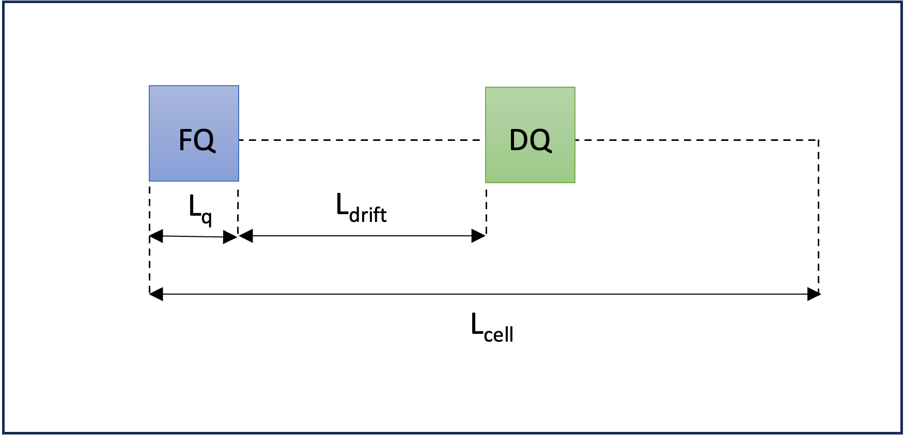
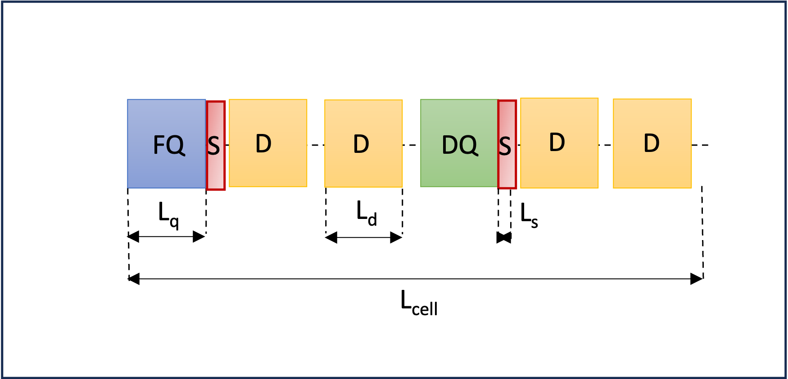
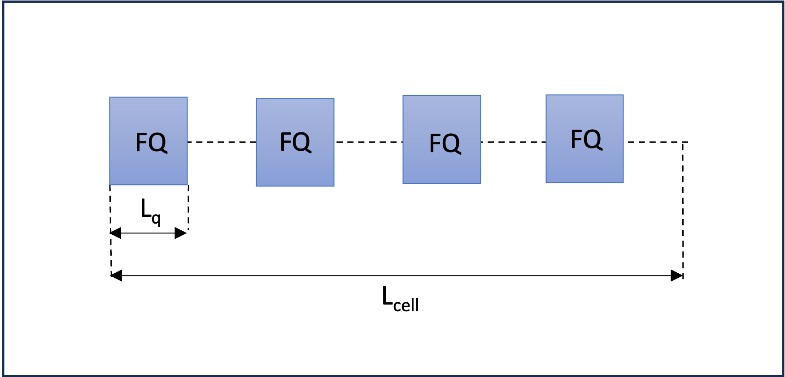

# MAD-X WORKSHOP JUAS 2024
**N. Fuster-Martínez, G. Sterbini, D. Gamba, S. Kostoglou, J. Olivares** 

## Tutorial 1: My first accelerator, a FODO cell

####Objectives:
The main goal of this tutorial is to learn how to define a simple magnetic lattice and compute the linear optics functions using MAD-X. For that, we are going to define a FODO lattice, which is the simplest configuration we can design to get a net focusing effect of the beam in both transverse planes.

Questions:
    
1.    Define a FODO lattice with:

      - the length of the cell, $L_{cell}$ = 100 m,
      - two quadrupoles, one focusing (FQ) and another one defocusing (DQ) of 5 m long ($L_{q}$),
      - the start of the sequence placed at the start of the first quadrupole,
      - the quadrupole focal length f = 200 m. (HINT: K1 x Lq= 1/f). 

Figure 1: FODO cell scheme with main parameters depicted.

   

2. Define a proton beam with a total energy $E_{tot}$ = 2 GeV. Activate the sequence and compute the periodic linear optics functions with the twiss MAD-X command. Then, plot the $\beta$-functions. If you found the maximum of the $\beta$-function of 460 m you succeeded!

3. Using the $\beta$-function plot obtained, can you estimate the phase advance of the cell? How does this value compare to the tune computed by MAD-X.
    
4. Try to run the twiss command with $E_{tot}$ = 0.7 GeV. What is the MAD-X error message? And if you change the focal length to 20 m? (Note that the error messages will appear in the terminal from which you launched the JupyterLab).

## Tutorial 2: My first matching

#### Objectives:
The main goal of this tutorial is to study the behavior of the linear optics functions when we vary the FODO cell magnetic properties. For that, we will use the linear thin lens optics solution and the twiss MAD-X module. The results of the two approaches will be compared and discussed.

By considering the periodic solution of the equation of motion for a FODO cell, and applying the thin lens approximation and the stability condition, we can derive the following relationships between the optical parameters, the magnet properties and the cell length:

Questions:

1. Try to TWISS the FODO cell defined in Tutorial 1 powering the quadrupoles to obtain a phase advance of ~ 90° in the cell using the thin lens approximation (Figure 1). 

2. What is the maximum beta-function value compared to the thin lens approximation solution from Figure 2?

3. Halve the focusing strength of the quadrupole, what is the effect of it on the maximum and minimum beta-functions and on the phase advance? Compare with the thin lens approximation from Figure 1 and Figure 2.

4. Compute the maximum beam size σ assuming a normalized emittance of 3 mrad mm and Etot = 7 TeV.

## Tutorial 3: Building a circular machine.

#### Objectives:
   - Build a circular machine by introducing dipoles into the FODO cell of Tutorial 1.
   - Use the MATCHING MAD-X engine to compute the strength of the magnets to get a desired tune.

1.    Consider now the FODO cell of Tutorial 2 and add 4 sector dipoles of 15 m long (assume 5 m of drift space between magnets). Consider a ring with 736 dipoles with equal bending angles.

Figure 4: Scheme of a FODO cell with dipoles.

2. Do the dipoles (weak focusing) affect the maximum of the beta-functions and the dispersion? Compute the relative variation with and without dipoles on the maximum beta-function on the two planes.

3. From the phase advance of the FODO cell compute the horizontal and vertical tunes of the machine.

4. Suppose you want to set a tune of (60.2,67.2), use the MAD-X matching engine on a single FODO to get it.

**BONUS:**

B1. Change the total beam energy to 7 TeV. What is the new tune of the machine? Why?

B2. What is the maximum tune that you can reach with such a lattice? (HINT: what is the maximum phase advance per FODO cell in the thin lens approximation?).

## Tutorial 4: Natural chromaticity.

#### Objectives:
   - Quantify the natural chromaticity of a FODO cell (from Tutorial 3).
   - First tracking of particles using the tracking MAD-X engine to study the beam dynamics for different initial conditions.

Figure 5: Chromaticity effect illustration.

1. Using the lattice and the MAD-X input file from Tutorial 3 match the tunes of the FODO cell to 0.25, both horizontal and vertical.

2. Using the chromaticity obtained from the TWISS, compute the tunes for particles with ∆p/p= 10^(-3).

3. Track particles with initial coordinates x, y, px, py = (1, 1, 0, 0) mm in 100 turns. Plot the x-px phase space. How does the particle move in the phase space turn after turn?

     (HINT: To use the TRACK MAD-X module you need to convert your lattice into thin and for that you need to have your SEQUENCE referred to the center of the elements).

4. Track a particle now with x, y, px, py = (100, 100, 0, 0) mm in 100 turns. Plot x-px phase-space. Does something change with respect to the previous case? Why?

**BONUS:**

B1. Repeat the tracking of points 3 and 4 but adding DELTAP = 10^(-2) to the TRACK command. How does the phase space look now? Is the tune still the same? It may help to look only at the first 4 turns to get a clear picture.

## Tutorial 5: Chromaticity correction and non-linearities.

#### Objectives:
   - Introduce sextupoles in the FODO cell for chromaticity correction.
   - Non-linearities impact on the beam dynamics.

Figure 6: Chromaticity correction scheme.

1. Add 0.5 m long sextupoles attached to the quadrupoles. With a matching block adjust the vertical and horizontal chromaticity of the cell (global parameters: DQ1 and DQ2) to zero, by powering the two sextupoles (K2_1 and K2_2). 

Figure 7: FODO cell with dipoles and sextupoles scheme.

2. Using the K2_1 and K2_2 obtained in point 1 and the β-functions and dispersion at the sextupole location, evaluate using the formula the sextupolar effect Q1 for a particle of  ∆p/p= 10^(-2). Compare the results obtained in the Tutorial 4.

3. Track a particle with initial conditions x, y, px, py = (1, 1, 0, 0) mm in 100 cells and ∆p/p= 10^(-2). Plot the x-px phase-space. Did you manage to recover the original tune for the off-momentum particle?

4. Track now a particle with initial coordinates x, y, px, py = (100, 100, 0, 0) mm in 100 cells. How does the particle move cell after cell? Do you see the tunes? What is going on?

**BONUS:**

B1. Move the tunes to (0.23, 0.23) and repeat the questions 3 and 4. Is the particle now stable?

## Tutorial 6: Building a transfer line.

#### Objectives:
   - Build a transfer line and compute the optics for some initial conditions.
   - Matching a transfer line.

1.    Build a transfer line for a 2 GeV proton beam of 10 m length with 4 quadrupoles of 0.1 m long (centered at 2, 4, 6, and 8 m). With K1 values of 0.1, 0.1, 0.1, 0.1 m^(-2), respectively. Can you find a periodic solution?

Figure 6: Transfer line scheme.

2. Can you find an initial conditions (IC) solution starting from (beta_x , alpha_x , beta_y , alpha_y) = (1, 0, 2, 0) m? Compute the corresponding quadrupole gradients. What are the final optical conditions at the end (beta_x_end , alpha_x_end , beta_y_end , alpha_y_end)?

3. Starting from (beta_x , alpha_x , beta_y , alpha_y) = (1, 0, 2, 0) m match the line to (beta_x_end , alpha_x_end , beta_y_end , alpha_y_end) = (2, 0, 1, 0) m at the end.

4. Starting from (beta_x , alpha_x , beta_y , alpha_y) = (1 , 0, 2, 0) m and the gradients obtained in the previous matching, match to the (beta_x_end , alpha_x_end , beta_y_end , alpha_y_end) found in the question number 2. Can you find back the K1 values of 0.1, 0.1, 0.1, 0.1 m^(-2), respectively. Compute the required gradients for this solution.

**BONUS:**

B1. Consider that the quadrupoles have an excitation current of a 100 A m^2 and an excitation magnetic factor of 2 T/m/A and an aperture of 40 mm diameter. Compute the magnetic field at the poles of the four quadrupoles for the two matching solutions of the exercise. (HINT: assume a linear regime and use a dimensional approach).
